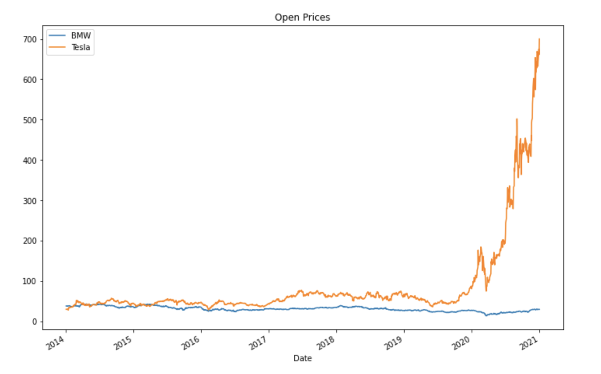
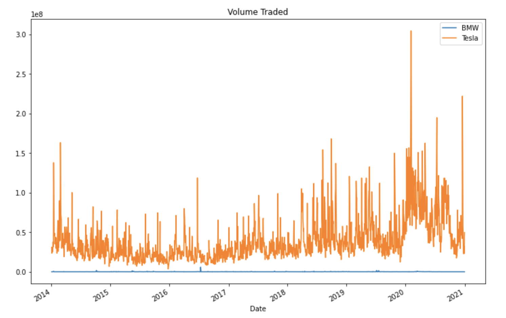
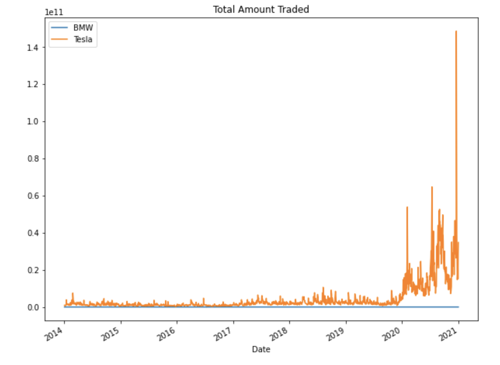
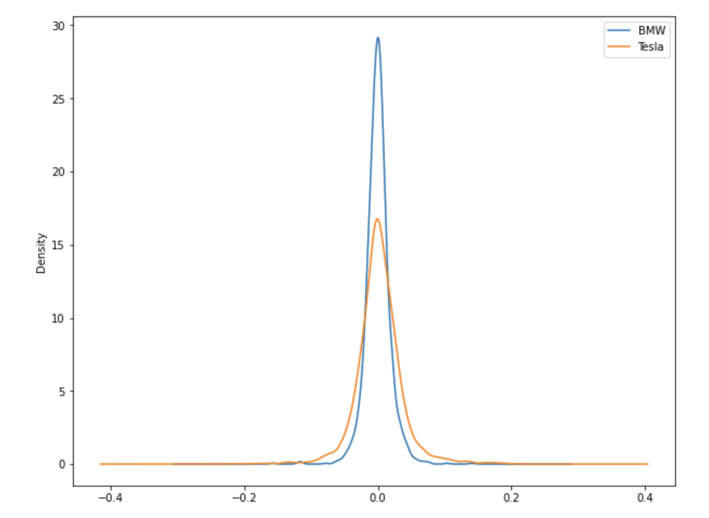
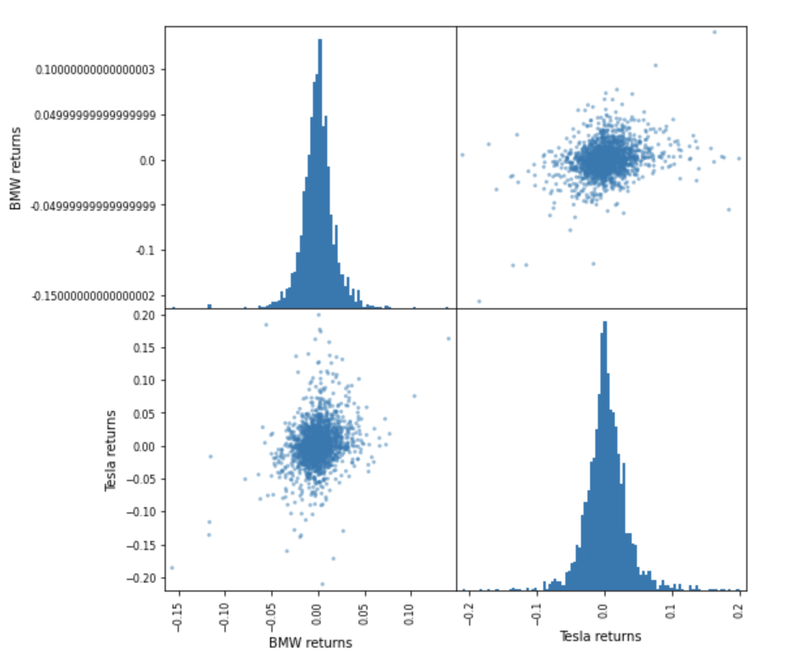
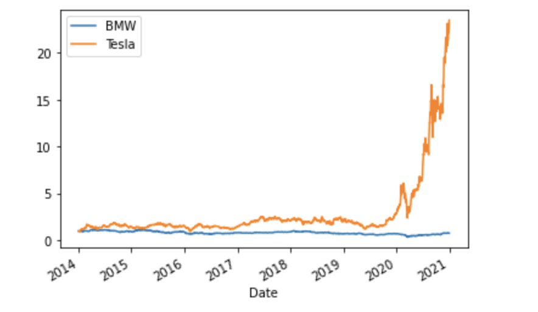

# BMW-vs-Tesla-Stock-and-Finance-analysis
An implementation to analyse the stock, financial and returns of companies BMW and Tesla

We will analyse data for the companies from 2014 to 2021

## Data Visualization
Let's visualize a linear plot of market open prices for BMW & Tesla stocks

From the above plot, we can see the opening prices of Tesla is higher as compared to BMW

Let's plot volume of stock that was traded each day

A clear picture will be seen when the total market cap is also considered. A simple way to do this is to calculate the total money traded by multiplying the volume with the open price.

Now let's plot total amount traded to see its trend.

## Financial analysis
Daily percentage return: r(t) = (p(t)/p(t-1)) - 1; where r(t) is return at time t and p(t) is price at time t. 
This helps in determining the percentage gain or loss and to analyze the volatility of the stock. Volatility is the rate at which the price of a stock increases or decreases over a particular period. Hence, if the stock rises and falls more than 1% for a period of time then it is called as a volatile market. When we plot a histogram and the distribution is wide then we can say its more volatile. For time (t-1), the 'shift' method is used to shift down/forward by period 1.

Let's plot a kernel density estimation (KDE) plot to get a better insight of daily percentage return and market volatality.

Looking at the histogram, we can say BMW has stable market but Tesla has high volatility because it has a wide distribution

Let's plot a scatter plot matrix to compare the returns between BMW & Tesla stocks and analyze the correlation between them

## Cumulative Return
Cumulative means the aggregation of stock amount over a period of time. While considering cumulative return, it is calculated according to the day the investment was made, unlike the daily return where it is calculated according to the previous day. If the cumulative return is above 1, profit is generated otherwise it's a loss.

Cumulative Return = i(i) = (1+r(t)).i(t-1); where i(t) is investement at time t and r(t) is return at time t.

From the above plot we can assert that Tesla has largest cumulative return than BMW over time.